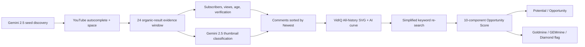

# AURORA

[](https://github.com/bvbvbv54/Aurora/actions/workflows/aurora.yml)
[](https://www.python.org/)
[](https://github.com/bvbvbv54/Aurora)
[](https://github.com/bvbvbv54/Aurora)
[](https://github.com/bvbvbv54/Aurora/stargazers)
[](https://github.com/bvbvbv54/Aurora/forks)
[](https://github.com/bvbvbv54/Aurora/issues)
[](https://github.com/bvbvbv54/Aurora/commits/main)

AURORA is a paced, resumable YouTube keyword-research pipeline. It uses a visible
SeleniumBase CDP browser, extracts search-result metadata, applies the requested exact
low-RPM scoring tree plus fix/high-RPM modifiers, certifies candidates with a stripped-title
search, and persists every completed stage to SQLite.

It is built for evidence-first discovery of short, practical tutorial opportunities:
Windows fixes, desktop and mobile app problems, operating-system issues, game fixes,
iPhone workflows, and phone-recordable banking/insurance actions targeting the US and
Canada. It never treats VidIQ keyword Volume or Competition as evidence.

## How it works



Every displayed counter comes from the live SQLite database or GitHub API. Incomplete
records are quarantined and requeued; they are not converted into invented zeroes.

The browser layer uses declared browser settings and stops a session when a CAPTCHA,
challenge page, or unusual-traffic response is detected. It does not alter fingerprint
surfaces, defeat challenges, or reuse challenge tokens.

## Quick start

```powershell
py -3.11 -m venv .venv
.\.venv\Scripts\python -m pip install -e ".[browser,llm,dev]"
.\.venv\Scripts\aurora --config config.yaml init-db
.\.venv\Scripts\aurora --config config.yaml seed --method method1 "APP"
.\.venv\Scripts\aurora --config config.yaml research --max-keywords 25 --regions US,CA
.\.venv\Scripts\aurora --config config.yaml report --full
```

## Recommended D-drive deep run

All mutable runtime data can be redirected with `--storage-root`. This includes SQLite,
reports, VidIQ screenshots/JSON, saved thumbnails, and the authenticated browser profile.
Project source and the unpacked extension remain read-only assets in the repository.

```powershell
.\scripts\start-deep-research.ps1 `
  -StorageRoot "D:\Aurora-data" `
  -Model "google/gemini-2.5-flash-lite" `
  -VisionModel "google/gemini-2.5-flash-lite" `
  -AiEvery 50 `
  -Regions "US,CA"
```

## One-command control and monitoring

```powershell
# Start in the background
.\scripts\aurora-control.ps1 start

# Show process, queue, Goldmine counts, and completeness health
.\scripts\aurora-control.ps1 status

# Follow the live research log with colored Diamond/GEMmine/Goldmine flags
.\scripts\aurora-control.ps1 watch

# Clean checkpoint pause / resume
.\scripts\aurora-control.ps1 pause
.\scripts\aurora-control.ps1 resume

# Last 100 log messages or a full report
.\scripts\aurora-control.ps1 tail
.\scripts\aurora-control.ps1 report
```

`watch` highlights `DIAMOND` in magenta, `GEMMINE` in cyan, `GOLDMINE` in yellow,
and collection failures in red. Statistics come directly from SQLite and GitHub; the
project does not insert sample opportunities or synthetic engagement numbers.

Equivalent direct command:

```powershell
$env:OPENROUTER_API_KEY="..."
aurora --config config.demo.yaml --storage-root "D:\Aurora-data" research `
  --profile deep --max-keywords 1000000 --regions US,CA `
  --allow-desktop --max-video-minutes 2 `
  --ai-guided --ai-every 50 --ai-provider openrouter `
  --ai-model google/gemini-2.5-flash-lite `
  --vision-model google/gemini-2.5-flash-lite --stop-on-ai-error
```

Set `OPENAI_API_KEY` before `generate`:

```powershell
.\.venv\Scripts\aurora generate --method method2 --subject "APP"
```

## Commands

- `init-db`: creates all tables.
- `seed`: inserts deduplicated manual keywords.
- `generate`: generates and stores seeds through the configured OpenAI model.
- `run-once`: processes one 60/40-scheduled pending seed.
- `research`: recursively processes multiple autocomplete, vidIQ, and specific mobile branches.
- `pause`: requests a clean stop between keywords.
- `resume`: clears the pause marker; interrupted `processing` work is recovered on restart.
- `status`: shows queue metrics and pause state.
- `report --full`: writes Markdown, JSON, and CSV analytics plus a selective video shortlist.
- `repair-metrics`: removes uncertifiable legacy evidence and requeues its seeds for complete
  collection rather than filling missing values with guesses.

## Custom recursive research

```powershell
aurora --config config.yaml research `
  --max-keywords 100 `
  --low-rpm-share 60 `
  --high-rpm-share 40 `
  --max-suggestions 8 `
  --max-depth 4 `
  --regions US,CA `
  --max-video-minutes 8
```

Press `Ctrl+C` for an immediate stop. For a checkpoint stop from another terminal:

```powershell
aurora --config config.yaml pause
aurora --config config.yaml status
aurora --config config.yaml resume
aurora --config config.yaml research --max-keywords 100
```

AI-guided category discovery accepts the user's constraints and incorporates recent
research findings:

```powershell
aurora --config config.yaml generate --method method1 `
  --subject "mobile social and creator apps" `
  --regions US,CA `
  --include "fast fixes, account settings, upload errors" `
  --exclude "desktop-only tools, physical products, luxury cars"
```

Choose OpenAI/ChatGPT, Gemini, or any OpenRouter model:

```powershell
$env:OPENAI_API_KEY="..."
aurora generate --provider chatgpt --model gpt-4o --method method1

$env:GEMINI_API_KEY="..."
aurora generate --provider gemini --model gemini-2.5-flash-lite --method method1

$env:OPENROUTER_API_KEY="..."
aurora research --profile deep --ai-guided --ai-provider openrouter `
  --ai-model anthropic/claude-sonnet-4
```

Provider selection changes only text-to-text discovery. Browser evidence and Opportunity
Scoring are provider-independent.

## AI visual classification

A separate low-cost multimodal model classifies every saved thumbnail and VidIQ graph:

- Thumbnail: `high` for clearly edited/designed artwork; `low` for a default frame, plain
  screenshot, weak crop, or minimally edited image.
- VidIQ All-history graph: `increasing`, `historical growth, recent plateau`, `flat`,
  `declining`, or `unreadable`.
- Each call returns only a label and 0–100 confidence, and the model/status/confidence are
  stored with the evidence.
- The default is `google/gemini-2.5-flash-lite` through OpenRouter with low-detail image input
  and at most 60 output tokens. A failed or unreadable response fails the completeness gate;
  it is never silently replaced.

Before restarting an upgraded database:

```powershell
aurora --config config.demo.yaml --storage-root "D:\Aurora-data" repair-metrics
```

This quarantines old incomplete rows and requeues their keywords. A keyword cannot be
certified unless all 24 SERP subscriber states and AI thumbnail classifications are complete,
comments have a terminal collection state, VidIQ is authenticated, the `All` range is
confirmed, VPH is present, and both SVG and AI graph classifications are readable.

## Research profiles

- `--profile quick`: 5 keywords, depth 1, 3 suggestions, 2 scroll passes, 1 detailed validation.
- `--profile normal`: 25 keywords, depth 3, 6 suggestions, 5 scroll passes, 2 validations.
- `--profile deep`: 100 keywords, depth 5, 10 suggestions, 8 scroll passes, 5 validations.
- `--profile custom`: use explicit exploration arguments.

Profiles never change Opportunity Score weights, thresholds, gates, or classifications.

## Opportunity Score

Every searched keyword receives ten independent 0–100 component scores:

1. Demand
2. Competition derived from YouTube channels/results
3. Small Creator Success
4. Evergreen
5. Content Gap
6. Thumbnail Weakness
7. Search Intent
8. Long-tail Precision
9. Buyer Intent
10. Trend Persistence from the actual vidIQ video-history SVG curve

The weighted result is classified as `Rejected`, `Potential`, `Opportunity`, `Goldmine`, or
`GEMmine`. The largest component weight is 13%, so no single signal can decide the result.
Goldmine/GEMmine additionally require multi-component alignment, simplified-query validation,
evergreen evidence, and a persistent vidIQ history curve.

vidIQ keyword Volume and vidIQ Competition are excluded. Matching Terms may create recursive
research branches, while the actual free-extension video history curve is the only vidIQ
signal that drives Trend Persistence. VPH may be recorded for audit but has zero score weight.

## Operational properties

- Every Method 1 app expands into how/why/what/when/who/where/which/vs/how-much/fix families.
- Several relevant YouTube autocomplete branches are queued instead of only the first.
- vidIQ Matching Terms and mobile-specific branches recurse to a configurable depth.
- The scheduler targets 60% low-RPM/high-volume and 40% high-RPM/buyer-intent research.
- All loaded first-page organic videos are scored for views, subscribers, verification,
  age, thumbnail evidence, big-channel saturation, and channel dominance.
- Ad click protection disables YouTube ad surfaces, blocks external-link click events and
  `window.open`, pauses/mutes playback, closes any external tab that still appears, and
  restores focus to YouTube.
- Old candidates record newest-comment age, vidIQ VPH, engagement, outlier, total views,
  and a curve classification. vidIQ Competition is never used.
- Final reports exclude expensive/physical/comparison concepts and broad tutorials that
  are unsuitable for a quick phone screen recording with AI voiceover.
- Maximum results, recursion, production time, regions, and pacing are configurable.
- Transactions commit after seed, SERP, and goldmine stages.
- Challenge detection returns the current seed to `pending`.
- Selenium selector fallbacks handle common YouTube result layouts.
- VIDIQ can be loaded by putting an unpacked extension path under
  `browser.extension_dirs`; core scoring does not depend on it.
- The GitHub workflow is manual (`workflow_dispatch`) so browser sessions remain
  observable and do not run perpetually.

## Docker

```bash
docker build -t aurora .
docker run --rm -v "$PWD:/app/state" aurora report
```
